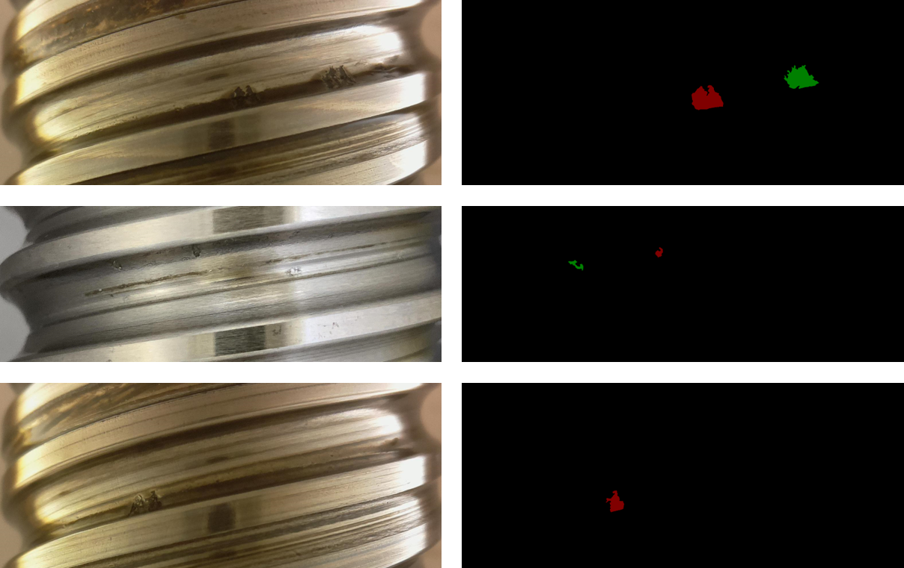

# BSData - dataset for Instance Segmentation

The dataset contains 1104 channel 3 images with 394 image-annotations for the surface damage 
type “pitting”. The annotations made with the annotation tool [labelme](https://github.com/wkentaro/labelme), 
are available in ``JSON`` format and hence convertible to VOC and COCO format. All images come from two BSD types. 
The dataset available for download is divided into two folders, data with all images as ``JPEG``, label with all annotations, 
and ``saved_model`` with a baseline model. The authors also provide a python script to divide the data and labels into three 
different split types – `train_test_split`, which splits images into the same train and test data-split the authors used 
for the baseline model, `wear_dev_split`, which creates all 27 wear developments and `type_split`, which splits the data 
into the occurring BSD-types. 
One of the two mentioned BSD types is represented with 69 images and 55 different image-sizes. All images with this BSD 
type come either in a clean or soiled condition. 
The other BSD type is shown on 325 images with two image-sizes. Since all images of this type have been taken with continuous 
time the degree of soiling is evolving. 
Also, the dataset contains as above mentioned 27 pitting development sequences with every 69 images. 

For more information visit the dataset-publication: [Industrial Machine Tool Element Surface Defect Dataset](https://www.youtube.com/watch?v=dQw4w9WgXcQ&ab_channel=RickAstleyVEVO)

On the left image-examples, on the right associated VOC-Annotations.

If you consider using this dataset we recommend to `clone` this repository.

## Instruction dataset split 

The authors of this dataset provide 3 types of different dataset splits. 
To get the data split you have to run the python script `split_dataset.py`. 
Script inputs:
- split-type (mandatory)
- output directory (mandatory)

### Different split-types:
1. `train_test_split`: splits dataset into train and test data (80%/20%)
2. `wear_dev_split`: splits dataset into 27 wear-developments 
3. `type_split`: splits dataset into different BSD types

### Example:
`C:\Users\Desktop>python split_dataset.py --split_type=train_test_split --output_dir=BSD_split_folder` 

**Result:** 
`./BSD_slit_folder/train/` and `./BSD_slit_folder/test/`

